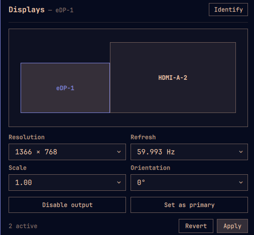

# Displays Arranger — Omarchy bar plugin

Arrange your monitors from the Omarchy bar, macOS-style.



A `󰍹` button in the bar opens a popup where you **drag screens to lay them
out** (they stay edge-to-edge — no dead gaps your cursor can't cross), set
**resolution, refresh rate, scale and rotation**, pick the primary display, and
enable/disable outputs. **Apply** writes the arrangement to
`~/.config/hypr/monitors.lua` and reloads Hyprland, with a **12-second
auto-revert** if something goes wrong.

Built with Omarchy's own Quickshell UI kit (`qs.Ui` / `qs.Commons`), so it
matches the active theme and restyles when you switch themes.

## Why

Omarchy has no graphical display arranger — you hand-edit `monitors.lua`.
Hyprland also can't apply monitor changes over IPC on Omarchy (`hyprctl
keyword` is rejected by the Lua parser), so every display tweak means editing a
file and reloading. This plugin does that for you, safely.

## Install

```bash
omarchy plugin add https://github.com/faperac/omarchy-displays.git --enable
```

Pick a bar section (left / center / right) when prompted. Move it later with:

```bash
omarchy bar move faperac.displays --section center --index 0
```

**Requirements:** `quickshell` and `jq` (both ship with Omarchy). No other
dependencies, no elevated privileges.

## Using it

Click the `󰍹` bar button.

| Action | How |
|---|---|
| Select a display | click its card |
| Move it | drag the card — it snaps to the others, always edge-to-edge |
| Resolution / refresh / scale / orientation | the four dropdowns |
| Enable / disable an output | **Disable output** / **Enable output** |
| Choose the primary (0,0) display | **Set as primary** |
| Flash each screen's name | **Identify** |
| Apply the layout | **Apply** — then **Keep** within 12s, or it auto-reverts |
| Undo pending edits | **Revert** |

Bind a key if you like (Hyprland `bindings.lua`):

```
omarchy-shell faperac.displays toggle
```

## What it writes

**Apply** runs the bundled `bin/omarchy-displays --from-native`, which:

1. backs up `~/.config/hypr/monitors.lua` to `monitors.lua.bak.<timestamp>`
2. rewrites the block between
   `-- >>> omarchy-displays managed block` markers with `hl.monitor({ … })`
   calls — everything outside the block is left untouched
3. runs `hyprctl reload` and checks `hyprctl configerrors`

`transform` (rotation) and `mirror` are written; `vrr` / `bitdepth` are not.
If the stock catch-all `hl.monitor({ output = "", … })` is still active in your
`monitors.lua`, the managed block is appended after it and wins.

Undo a bad Apply by hand:

```bash
cp ~/.config/hypr/monitors.lua.bak.<timestamp> ~/.config/hypr/monitors.lua
hyprctl reload
```

## Standalone (no bar)

The bundled CLI also works on its own — run it from the installed plugin dir:

```bash
D=~/.config/omarchy/plugins/faperac.displays/bin/omarchy-displays
$D                       # standalone Quickshell window, same UI
$D --print               # print the Lua for the current live layout
$D --from-native SRC     # write monitors.lua from native monitor= lines
```

## Uninstall

```bash
omarchy plugin remove faperac.displays
```

## Development

```bash
git clone https://github.com/faperac/omarchy-displays
ln -sfn "$PWD/omarchy-displays" ~/.config/omarchy/plugins/faperac.displays
omarchy restart shell
```

Files under `~/.config/omarchy/plugins/` hot-reload on save.

## Files

```
manifest.json         plugin manifest (kind: bar-widget)
BarWidget.qml         the 󰍹 bar button + popup loader
Panel.qml             the popup UI (qs.Ui / qs.Commons)
logic.js              shared model core: parse / snap / adjacency / serialise
bin/omarchy-displays  the monitors.lua writer + standalone window
qml/Displays.qml      standalone-window build of the UI (no qs.* deps)
preview.png · CHANGELOG.md · LICENSE
```

## License

MIT — see [LICENSE](LICENSE).
